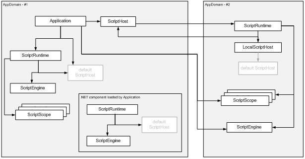
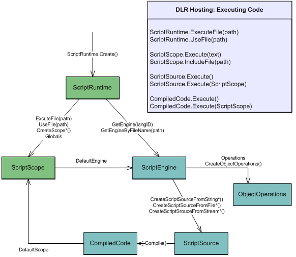
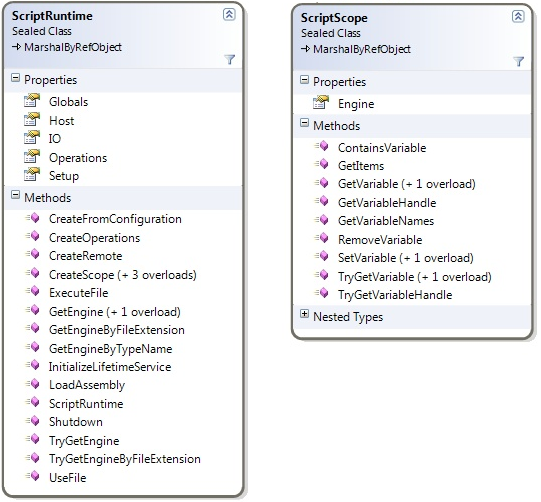
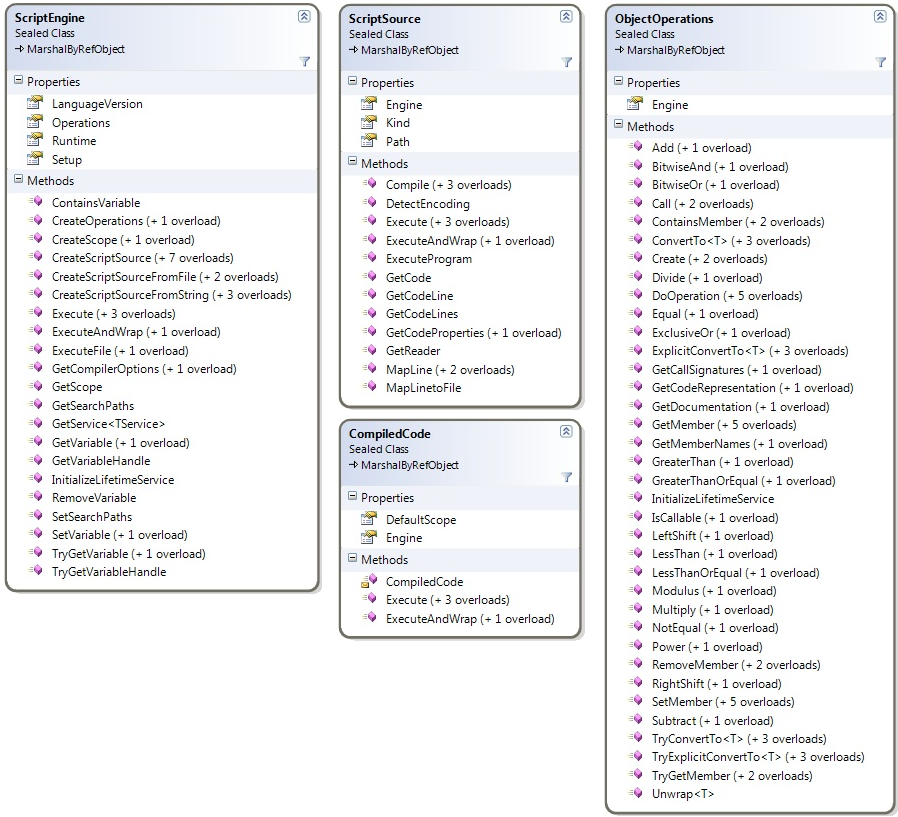
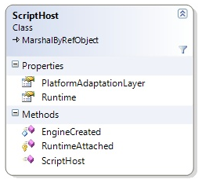
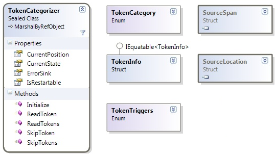
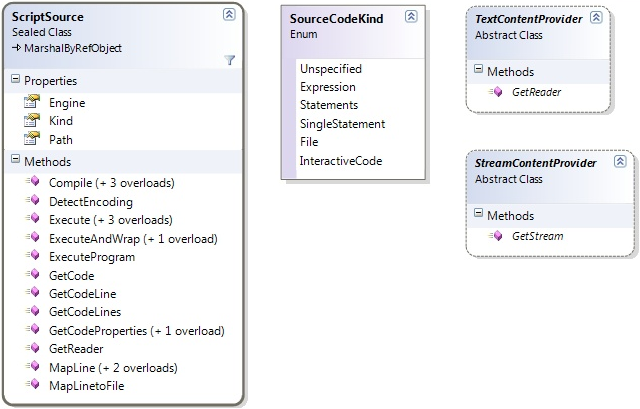

.. highlightlang:: c

.. hosting-overview:

********************
DLR Hosting Overview
********************

One of the top DLR features is common hosting support for all languages implemented on the DLR.  The primary goal is supporting .NET applications hosting the DLR's ScriptRuntime and engines for the following high-level scenarios:

- SilverLight hosting in browsers
- MerlinWeb on the server
- Interaction consoles where the ScriptRuntime is possibly isolated in another app domain.
- Editing tool with colorization, completion, and parameter tips (may only work on live objects in v1)
- PowerShell, C#, and VB.NET code using dynamic objects and operating on them dynamically in the same app domain

A quick survey of functionality includes:

- Create ScriptRuntimes locally or in remote app domains.
- Execute snippets of code.
- Execute files of code in their own execution context (ScriptScope).
- Explicitly choose language engines to use or just execute files to let the DLR find the right engine.
- Create scopes privately or publicly for executing code in.
- Create scopes, set variables in the scope to provide host object models, and publish the scopes for dynamic languages to import, require, etc.
- Create scopes, set variables to provide object models, and execute code within the scopes.
- Fetch dynamic objects and functions from scopes bound to names or execute expressions that return objects.
- Call dynamic functions as host command implementations or event handlers.
- Get reflection information for object members, parameter information, and documentation.
- Control how files are resolved when dynamic languages import other files of code.

Hosts always start by calling statically on the ScriptRuntime to create a ScriptRuntime.  In the simplest case, the host can set globals and execute files that access the globals.  In more advanced scenarios, hosts can fully control language engines, get services from them, work with compiled code, explicitly execute code in specific scopes, interact in rich ways with dynamic objects from the ScriptRuntime, and so on.

High-level Hosting Model Concepts
=================================

The hosting APIs can be grouped by levels of engagement.  Level One uses a couple of types for executing code in 
scopes and working with variable bindings in those scopes.  Level Two involves a few more types and supports more control over 
how code executes, using compiled code in various scopes, and using various sources of code.  Level Three opens up to several advanced 
concepts such as overriding how filenames are resolved, providing custom source content readers, reflecting over objects for design-time tool 
support, providing late bound variable values from the host, and using remote ScriptRuntimes.

There are three basic mechanisms for partially isolating state for code executions within a process.  .NET offers Appdomains, 
which allows for code to run at different trust levels and to be completely torn down and unloaded.  The DLR offers multiple 
ScriptRuntimes within an AppDomain, each having its own global object of name bindings, distinct references to .NET namespaces 
from specified assemblies, distinct options, etc.  The DLR also provides ScriptScopes which provide variable binding isolation, 
and you can execute code in different scopes to work with distinct bindings of free variable references.

It is important for the DLR to support distinct ScriptRuntimes within .NET's AppDomains for a couple of reasons.  First, key customers betting on us require the lighter-weight isolation than what AppDomains provide.  Second, consider two independent .NET components loading as extensions to an application.  Each component wants to provide scripting support to end users.  The components should be able to do so without having to worry about how they might clash with other script-enabled components.  Multiple ScriptRuntimes also makes the main application's job easier since it does not have to provide a model for independent components getting access to and coordinating code executions around a central ScriptRuntime.
There's a rich set of ways to execute code.  Our goal is to strike a balance between convenient execution methods on various objects and keeping redundancy across the types to a minimum.  The diagram below shows how to navigate to the key objects for running code.  The Sections on Levels One and Level Two below talk about types in this diagram (green being Level One types):

Level One -- Script Runtimes, Scopes, and Executing Files and Snippets
======================================================================

For simple application programmability, you want to provide a host object model that dynamic languages code can use.  You then want to execute files of code that consume that object model.  You may also want to get the values of variables from the dynamic language code to use dynamic functions as command implementations or event handlers.

There are two types you will use at this level.  The ScriptRuntime class is the starting point for hosting.  You create a runtime with this class.  The ScriptRuntime represents global script state, such as referenced assemblies and a global object (a ScriptScope).  The ScriptScope class essentially represents a namespace.  Hosts can bind variable names in ScriptScopes, fetch variable values, etc.  Hosts can execute code within different scopes to isolate free variable resolutions.

There are a lot of members on these types because they are also used for Level Two and Level Three.  For Level One you only need a few members and can ignore the rest.  You need to create a ScriptRuntime, from which you might use ExecuteFile or Globals.  The Globals object lets you set variables to provide access to a host object model.  From ScriptScope, you will likely only use GetVariable and SetVariable.

These types are shown in the diagram:

The ScriptRuntime.GetEngine and ScriptScope.Engine are bridges to more advanced hosting functionality.  In Level Two and Level Three scenarios, the other members of ScriptRuntime and ScriptScope will be useful along with ScriptEngine.

Code Sample -- Application Programmability
------------------------------------------

Sample::

    public class Level_1 {
        ScriptRuntime env = ScriptRuntime.CreateFromConfiguration();
        MyHostObjectModel hostOM = new MyHostObjectModel();
    
        /// 

        /// Shows setting Host OM on globals so that dynamic languages
        /// can import, require, etc., to access the host's OM.
        /// 

        /// my_user_script.py:
        /// import HostModule
        /// def foo () ...
        /// HostModule.UserCommands["foo"] = foo
        /// 
        public void RunFile_Isolated_Scope_ImportsFromHost() {
            env.Globals.SetVariable("HostModule", hostOM);
            // Imagine this runs my_user_script.py above.
            env.ExecuteFile(GetFileFromUserOrSettings());
        }
    
        delegate void Command();
    
        /// 

        /// Shows getting command implementations from dynamic language.
        /// Assumes menu item text is command name in table.
        /// Builds on previous function.
        /// 

        public void Run_User_Command_from_MenuItem (string menuItemName) {
            // UserCommands is Dictionary<string, Command>.
            hostOM.UserCommands[menuItemName]();
        }
    
        /// 

        /// Shows discovering command implementations from globals in scope.
        /// Above user code explicitly added commands, but this code finds
        /// commands matching a delegate type, Command.
        /// 

        public void Collect_User_Commands_From_File (string menuItemName) {
            env.Globals.SetVariable("HostModule", hostOM);
            ScriptScope scope 
                = env.ExecuteFile(GetFileFromUserOrSettings());
            // UserCommands is dictionary from string to Command.
            Command fun;
            foreach (string id in scope.GetVariableNames()) {
                bool got_fun = scope.TryGetVariable<Command>(id, out fun);
                if (got_fun) {
                    my_OM.UserCommands[id] = fun;
                }
            }
        }
    }

Level Two -- Engines, Compiled Code, Sources, and Object Operations
===================================================================

The next level of engagement involves operating directly with engines and abstractions of source code and compiled code.  You can compile code and run it in any scope or its default scope.  You also have more control over how you provide sources to the DLR.

Besides the new types you'll use for Level Two scenarios, you will likely use more of the ScriptRuntime and ScriptScope classes.  You'll certainly use their members to get to engines.  You'll likely use more flavors of getting and setting variables on scopes as you have richer interactions with dynamic code.  You might use the ability of scopes to support executing multiple languages within one scope, using execute methods on engines.

The main new types you'll use in Level Two scenarios are ScriptEngines, ScriptSources, and ObjectOperations.  ScriptEngines are the work horse.  They offer various ways to execute code and create ScriptScopes and ScriptSources.  There are several members on ScriptEngine for working with ScriptScope variables.  These give you the engine's specific language view of variable operations in any scope, regardless of any language possibly associated with the scope.  ScriptSources offer methods for executing code in various ways from different kinds of sources.   

You may use ScriptRuntime.LoadAssembly to add namespaces to ScriptRuntime.Globals from a .NET assembly.  The top-level namespaces in the assembly become members of Globals.  You can access sub namespaces as members of the top-level namespaces.  Languages can then make the .NET assembly contents available via their mechanisms, such as import, require, notion of globals, etc.

ObjectOperations provide a large catalogue of object operations such as member access, conversions, indexing, and operations like addition.  There are several introspection and tool support services that we'll discuss in Level Three scenarios.  You get ObjectOperation instances from engines, and they are bound to their engines for the semantics of the operations.  There is a default instance of ObjectOperations you can share across all uses of the engine.  However, very advanced hosts can create new instances of ObjectOperations, which is explained in the references section.

These are the main types of level two:

Code Sample -- REPL and Merlin Web
----------------------------------

Sample::

    public class Level_2 {
        ScriptRuntime env = ScriptRuntime.CreateFromConfiguration();
    
        public void REPL_fragments {
            ScriptSource input;
            object result;
            // Assume user has chosen a context with the REPL's 
            // default scope and the Python language.
            ScriptScope defaultScope = env.CreateScope();
            ScriptEngine curEngine = env.GetEngine("py");
    
            // Use interactive source units for special REPL variables
            // or syntax, such as IPy's underscore or VB's '?',
            // provided by standard interpreters for the languages.
            ScriptSource input 
                = curEngine
                    .CreateScriptSourceFromString
                      // E.g., input is "x = 'foo'".
                      (GetInputAsString(), 
                       SourceCodeKind.InteractiveCode);
            result = input.Execute(defaultScope);
            REPLOutput.WriteLine(curEngine
                                   .Operations
                                     .GetObjectCodeRepresentation(result));
    
            // Assume user has chosen somehow to switch to Ruby.
            curEngine = env.GetEngine("rb");
            // E.g., input is "puts x"
            input = curEngine
                      .CreateScriptSourceFromString
                        (GetInputAsString(), 
                         SourceCodeKind.InteractiveCode);
            result = input.Execute(defaultScope);
            System.Console.WriteLine
                            (curEngine
                               .Operations
                                 .GetObjectCodeRepresentation(result));
    
            // Assume user has chosen to execute a file from another 
            // language, and you want to set the REPL's context to that
            // file's scope.  Use scope now for interactions like above,
            // and save it for use with this file later.
            ScriptScope scope = env.ExecuteFile(GetFileFromUserOrEditor());
            curEngine = scope.Engine;
        }
    
    
        public delegate string OnLoadDelegate();
    
        // MerlinWeb:
        public void ReUse_CompiledCode_Different_Scopes() {
            ScriptEngine engine = env.GetEngine("rb");
            CompiledCode compiledCode 
              = engine.CreateScriptSourceFromFile("foo.rb").Compile();
    
            // on each request, create new scope with custome dictionary
            // for latebound look up of elements on page.
            IAttributesCollection attrColl = GetNewMyAttrColl();
            attrColl["Page"] = thisRequestPage;
            ScriptScope scope = env.CreateScope(attrColl);
            compiledCode.Execute(scope);
            // Expect on_Load function name to be defined, or throw error.
            // Could have used scope.GetVariable but it's case-sensitive.
            engine.GetVariable<OnLoadDelegate>(scope, "on_Load")();
        }
    
    }
    

Level Three -- Full Control, Remoting, Tool Support, and More
=============================================================
Level three engagement as a host gives you full control over the ScriptRuntime.  There are many things hosts can do at this level from controlling runtime configuration, to handling runtime exceptions, to using remote ScriptRuntimes, to providing full programming tool support with completion, parameter info pop-ups, and colorization. 

With level three support, you can create a ScriptRuntimeSetup object to control which languages are available or set options for a ScriptRuntime's behavior.  For example, you can limit the ScriptRuntime certain versions of particular languages.  You can also use .NET application configuration to allow users to customize what languages are available.

Another simple mechanism in level three is deriving from ScriptHost.  This lets you provide a custom PlatformAdaptationLayer object to override file name resolution.  For example, you might only load files from a particular directory or go to a web server for files.   A host communicates its sub type of ScriptHost to the DLR when it creates a ScriptRuntime.  Many hosts can just use the DLR's default ScriptHost.  ScriptHost looks like:

The ObjectOperations class provides language-specific operations on objects, including some tool building support.  ObjectOperations includes introspection of objects via members such as GetMemberNames, IsCallable, GetCallSignatures, GetDocumentation, and GetCodeRepresentation.  These give you a language-specific view in that you see members of objects and signatures from the flavor of a specific language.  For example, you would see the Python meta-programming members of objects that Python manifests on objects.  ObjectOperations enables you to build tool support for dynamic languages on the DLR, but you need another set of objects for parsing code.

Hosts can get parsing support for providing colorization in editors and interpreters.  The following are the types used for that functionality:

Hosts that implement tools for programmers will likely also create ScriptSources and implement TextContentProviders so that tokenizers can read input directly from the host's data structures.  For example, an editor with a file in memory (in an editor buffer) could implement a TextContentProviders that reads input directly from the buffer's data structure.  The types relating to sources are:

